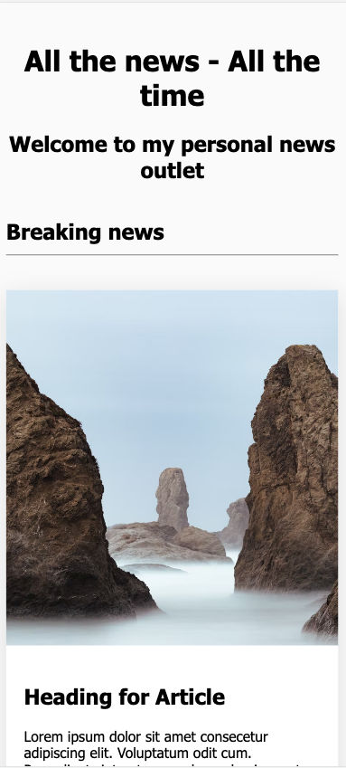
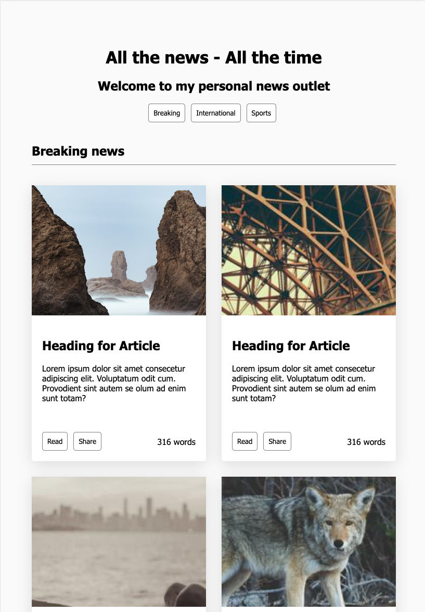
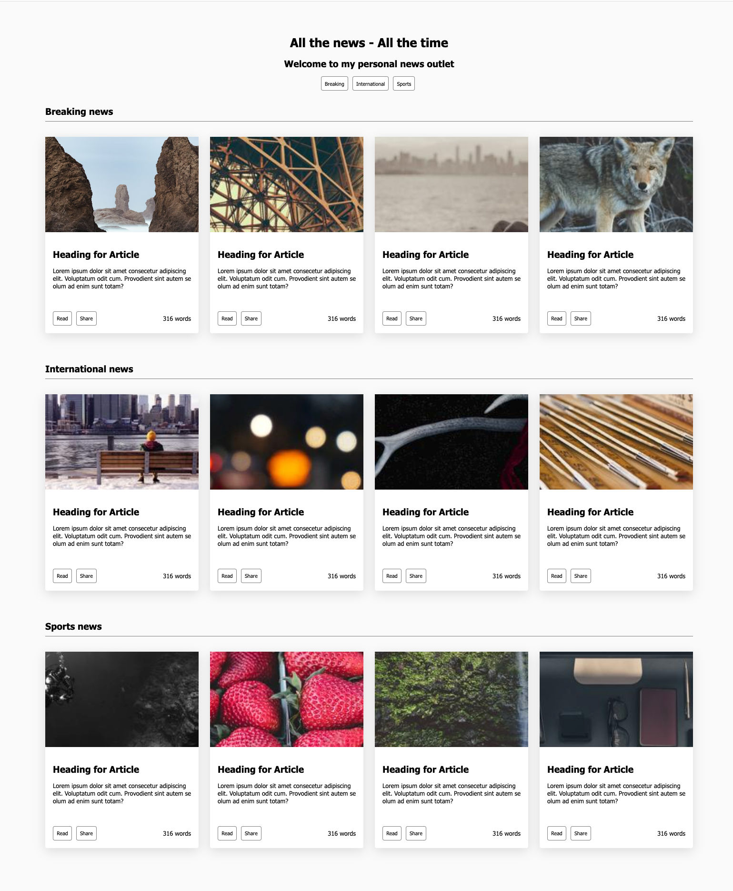

# ASSIGNMENT : News Gallery

This test is all about HTML and CSS - and we're going to build a News site (without any functionality). Your task is simple: make a complete HTML page looking like the designs below.

The news site should:

- present 3 different sections of news; Breaking, International and Sports
  - There should be 4 news articles (with fictional content) in each section
- Each news article should:
  - have a picture
  - have a heading and content with some text (type `lorem10` and hit tab in VS code and see what it does)
  - have two buttons (`Read` and `Share`) with a hover effect that changes the color of the button

You don't need to write any functionality; buttons and links does not have to navigate anywhere. It's all about the structure and layout of the page for this weekend test.

The CSS should be crafted with:

- A *mobile first* approach. (start with 1 news-item per row and no navbar)
- Consideration for different browsers' compatibility, such as Chrome and Safari.
- A consistent naming convention and code style, linted (see below)

## Wireframe designs

### Mobile

### Tablet

### Desktop

You should:

- Use a consistent naming convention, like BEM.
- Treat this like a client request. Follow the wireframe above.

You may use:

- More than one CSS file, but make sure no build step is required.
- Photos from <https://picsum.photos>.

You may **not**:

- Use Bootstrap, jQuery or similar.
- Create a blinking monster!

Good luck!

## Handing in the solution

In your Google Drive, we want you to submit:

- One folder with the name `cssGallery`
- Inside that folder upload:
  - your `index.html` file (found in the `src`-folder in this repository)
  - your CSS file(s), do *NOT* put the CSS-files in a separate folder
  - keep the `index.html` and the CSS files directly in `cssGallery` (*NO* subfolders)

## Some help

### First time Node-users

There are some Node and JavaScript things going on in this test, but nothing that you will need to *write* to make this work. But there are a few things to *run*.

- First install Node 16 (<https://nodejs.org/en/blog/release/v16.14.2/>) or `https://github.com/nvm-sh/nvm/blob/master/README.md`
  - If this worked out alright, `node --version` should show something starting with `v16.`.
- After cloning this repo (and `cd` into it);
  - run `npm install` that will install all tools for you.

You can now follow the rest of the description of the helpers below, which all will use `npm` to do it's job.

### Helper

We have created some help for you to manage the testing (Install dependencies with `npm install`):

- Start the application by running `npm start` (or just open `index.html` in the browser)
- Run linting through `npm run lint` (see below)
- Run tests with `npm test`. (see below)
- Open the Cypress test running using `npm run cypress`

### A word on the testing

We have written some tests in [Cypress](https://www.cypress.io/) for you. You can verify that the page is displayed in the correct way for different viewport sizes, using these tests.

Important to note: The tests are there to GUIDE you (and help us verify your solution). Do not stare blindly at the test, if you interpret the test in a way that makes your code and end-result ugly, then your interpretation is most likely wrong. Look at the Wireframes and let them guide you and let the test act as a helpful tool, not a leash-holding master.

You don't need to change our tests (hint: we will verify your code using these tests), but you can add more tests if you want. Don't hand in the tests.

There are two ways of running the tests:

- `npm run cypress` - this will open the Cypress test runner. Here you will see the site as it looks for Cypress. You can also easily rerun and step back in the test steps.
- `npm test` - this will run Cypress in headless mode, which means that it will not open a browser. It will, however, run the same tests and output the result.

### A word on the linting

We are using a tool called [`stylelint`](https://www.npmjs.com/package/stylelint) to lint your code. It will lint the code for you and ensure that you are not using CSS rules that doesn't work in unsupported browsers. Unsupported for us means:

- default rules for the major source of validation of browser rules - [browserlist](https://github.com/browserslist/browserslist) (`> 0.5%, last 2 versions, Firefox ESR, not dead`, meaning the browsers that 99.5% of the users globally uses, last 2 versions of each browser, Firefox and not dead browsers)
- It will also push you to use [BEM-naming convention](http://getbem.com) for your class selectors

Run the linting using `npm run lint`
Fix autofixable lint errors with `npm run lint -- --fix`

## FAQ

Should we use semantic HTML?
> Yes - absolutely.
